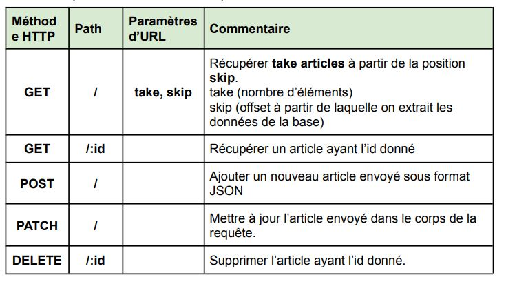

# projet de fin de module
=======

##  Developpement d'un blog
1. Backend
    - NodeJS Express
        - Installation
        pour l'installer, executez la commande `npm install -g express-genertor`
        Puis executez la commande `express`.
        pour installer les dependencies: `npm install -g`.
        [+détails](https://expressjs.com/en/starter/generator.html).
    - Ajouter les routes 
        - Nous ajoutons dans les fichier routes/articles.js, routes/commentaires.js,routes/users.js, routes/categories.js permettant d'effectuer les opérations de base CRUD (créer, lire, mettre à jour, supprimer), pour articles,commentaires,categories et users.
    
    - REST CLIENT
        - Nous pouvons utiliser l'extension de visual studio code **REST CLIENT** pour tester nos requetes HTTP directement.
    - L'ORM Prisma
        - Prisma est un ORM de nouvelle génération et open source pour Node.js.Il se compose des outils suivants:

            - Prisma Client : client de base de données généré automatiquement et de type sécurisé
            - Prisma Migrate : modélisation déclarative des données et migrations personnalisables
            - Prisma Studio : interface utilisateur moderne pour afficher et modifier les données 
    - Faker
        - Faker est une bibliothèque populaire qui génère de fausses données qui peuvent être utilisées  dans les tests.
        - pour l’installer nous exécutons la commande `npm i @faker-js/faker`

        

